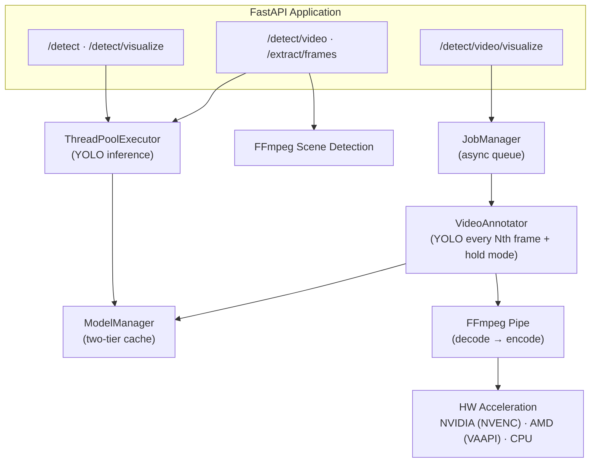

# Vision API Server

YOLO-based object detection REST API built with FastAPI. Supports image and video analysis with NVIDIA CUDA, AMD ROCm, and CPU backends.

## Features

- **Image Detection** — object detection with JSON response or annotated image output
- **Video Analysis** — smart frame extraction with scene-change detection
- **Video Annotation** — async pipeline: YOLO every Nth frame + hold mode for real-time bbox overlay
- **Multi-Backend** — NVIDIA GPU (CUDA/NVENC), AMD GPU (ROCm/VAAPI), CPU
- **Hardware-Accelerated Encoding** — auto-detected FFmpeg HW accel for video decode/encode
- **Two-Tier Model Cache** — preloaded models (always in memory) + on-demand models with TTL eviction
- **Codec Flexibility** — H.264, H.265, AV1 output with configurable CRF quality

## Quick Start

### Local

```bash
pip install -r requirements.txt
uvicorn app.main:app --host 0.0.0.0 --port 8000 --reload
```

> Requires Python 3.13+ and FFmpeg installed on the system.

### Docker

```bash
cd docker

# NVIDIA GPU
./docker-up-nvidia.sh

# AMD GPU
./docker-up-amd.sh

# CPU only
./docker-up-cpu.sh
```

Detached mode: `./docker-up-detach-nvidia.sh` (same for amd/cpu).

Stop: `./docker-down-nvidia.sh` (same for amd/cpu).

**Port mapping:** container `8000` → host `3001`

### GPU Requirements

| Backend | Requirements |
|---------|-------------|
| NVIDIA | Driver 530+, `nvidia-container-toolkit`, CUDA-compatible GPU |
| AMD | ROCm 5.0+, supported GPU (RX 6000+, MI100+) |
| CPU | No special requirements |

## API Endpoints

| Endpoint | Method | Description |
|----------|--------|-------------|
| `/detect` | POST | Image detection → JSON |
| `/detect/visualize` | POST | Image detection → annotated JPEG |
| `/detect/video` | POST | Video smart-frame detection → JSON |
| `/detect/video/visualize` | POST | Submit video annotation job (async) |
| `/extract/frames` | POST | Extract key frames as base64 |
| `/jobs/{job_id}` | GET | Job status and progress |
| `/jobs/{job_id}/download` | GET | Download annotated video |
| `/models` | GET | List loaded/cached models |
| `/health` | GET | Health check |

Interactive docs available at `/docs` (Swagger UI) and `/redoc`.

### Usage Examples

```bash
# Health check
curl http://localhost:3001/health

# Image detection
curl -X POST "http://localhost:3001/detect?conf=0.6" \
  -F "file=@image.jpg"

# Image detection with specific model
curl -X POST "http://localhost:3001/detect?model=yolo26m.pt" \
  -F "file=@image.jpg"

# Image with bounding boxes
curl -X POST "http://localhost:3001/detect/visualize" \
  -F "file=@image.jpg" -o annotated.jpg

# Video analysis (smart frames)
curl -X POST "http://localhost:3001/detect/video?max_frames=20" \
  -F "file=@video.mp4"

# Video annotation (async job)
JOB=$(curl -s -X POST "http://localhost:3001/detect/video/visualize" \
  -F "file=@video.mp4" | jq -r '.job_id')

# Poll job status
curl http://localhost:3001/jobs/$JOB

# Download annotated video
curl http://localhost:3001/jobs/$JOB/download -o annotated.mp4
```

### Common Parameters

| Parameter | Type | Default | Range | Description |
|-----------|------|---------|-------|-------------|
| `conf` | float | 0.5 | 0.0–1.0 | Confidence threshold |
| `imgsz` | int | 640 | 32–2016 | Inference image size |
| `max_det` | int | 100 | 1–1000 | Max detections per image/frame |
| `model` | string | — | — | Model name (e.g. `yolo26s.pt`) |
| `classes` | string | — | — | Comma-separated class filter (`person,car`) |
| `detect_every` | int | 5 | 1–300 | YOLO every N frames (video annotation) |

## Models

YOLO26 models are downloaded automatically on first use:

| Model | Size | Trade-off |
|-------|------|-----------|
| `yolo26n.pt` | ~6 MB | Fastest, lower accuracy |
| `yolo26s.pt` | ~25 MB | Good balance |
| `yolo26m.pt` | ~50 MB | Medium |
| `yolo26l.pt` | ~80 MB | Higher accuracy |
| `yolo26x.pt` | ~130 MB | Most accurate, slowest |

## Configuration

All settings via environment variables or `.env` file:

| Variable | Default | Description |
|----------|---------|-------------|
| `YOLO_MODELS` | `'{}'` | Preloaded models as JSON, e.g. `{"yolo26s.pt":"cuda:0"}` |
| `YOLO_DEVICE` | `cpu` | Default device for on-demand models |
| `YOLO_MODEL_TTL` | `900` | Cached model TTL in seconds (min 60) |
| `MAX_FILE_SIZE` | `10485760` | Max image upload size in bytes |
| `MAX_EXECUTOR_WORKERS` | `4` | ThreadPoolExecutor workers |
| `INFERENCE_TIMEOUT` | `30.0` | Inference timeout in seconds |
| `LOG_LEVEL` | `INFO` | Logging level |
| `VIDEO_JOB_TTL` | `3600` | Completed job TTL in seconds |
| `VIDEO_JOBS_DIR` | `/tmp/vision_jobs` | Job files directory |
| `MAX_QUEUED_JOBS` | `10` | Max queued annotation jobs |
| `DEFAULT_DETECT_EVERY` | `5` | YOLO inference every N frames |
| `VIDEO_CODEC` | `auto` | `auto` / `h264` / `h265` / `av1` |
| `VIDEO_CRF` | `18` | Quality: 0=lossless, 18=near-lossless, 23=default |
| `VIDEO_HW_ACCEL` | `auto` | `auto` / `nvidia` / `amd` / `cpu` |
| `VAAPI_DEVICE` | `/dev/dri/renderD128` | AMD VAAPI render device |

## Architecture



### Key Design Decisions

- **Async inference** — YOLO runs in `ThreadPoolExecutor` via `run_in_executor()` to keep the event loop responsive
- **Two-tier model cache** — preloaded models (configured at startup, never evicted) + cached models (loaded on demand, TTL-based eviction)
- **Video annotation pipeline** — async job API with single background worker; YOLO every Nth frame with "hold mode" (reuse last detections for intermediate frames)
- **Smart frame extraction** — FFmpeg scene-change detection with configurable threshold and minimum interval between frames

## Limits

| Resource | Limit |
|----------|-------|
| Image upload | 10 MB default, 100 MB max configurable |
| Video upload | 500 MB |
| Image formats | jpg, jpeg, png, webp, bmp |
| Video formats | mp4, avi, mov, mkv, webm, wmv, flv |

## Project Structure

```
app/
├── main.py              # FastAPI app, endpoints, lifespan
├── config.py            # Pydantic settings from env vars
├── models.py            # Request/response Pydantic models
├── model_manager.py     # YOLO model lifecycle, two-tier cache
├── job_manager.py       # Video annotation job queue, TTL cleanup
├── video_annotator.py   # YOLO + hold mode video annotation
├── ffmpeg_pipe.py       # FFmpeg subprocess pipe decoder/encoder
├── hw_accel.py          # Hardware acceleration detection
├── video_utils.py       # Frame extraction, scene detection
├── inference_utils.py   # Async inference via ThreadPoolExecutor
├── image_utils.py       # Image validation and decoding
├── visualization.py     # Bounding box rendering
└── dependencies.py      # FastAPI dependency injection

docker/
├── nvidia/              # NVIDIA GPU Dockerfile + compose
├── amd/                 # AMD GPU Dockerfile + compose
├── cpu/                 # CPU-only Dockerfile + compose
└── *.sh                 # Up/down/detach scripts

tests/                   # pytest test suite
```

## Testing

```bash
python3 -m venv .venv
source .venv/bin/activate
pip install -r requirements.txt -r requirements-dev.txt
python -m pytest tests/ -v
```

## License

Copyright (C) 2026 Alexander Zinin <mail@zinin.ru>

Licensed under the GNU Affero General Public License v3.0 or later
(AGPL-3.0-or-later). See `LICENSE`.
